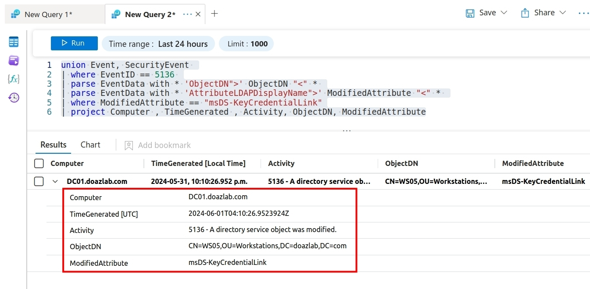

# Auditing and Detecting Changes to msDS-KeyCredentialLink (Shadow Credentials)

## Enable Auditing of changes to msDS-KeyCredentialLink
Changes to the `msds-KeyCredentialLink` attribute are not audited/logged with standard audit configurations. This required serious investigations and a partner firm in infosec provided us the answer: TrustedSec.

So, credit where it is due - this was amazing research: https://trustedsec.com/blog/a-hitch-hackers-guide-to-dacl-based-detections-part-1b. And, this should resolve the lack of auditing on the attribute used so commonly of late to escalate privileges.

Another shout out is due here to the Open Threat Research Forge, Roberto Rodriguez and Jose Luis Rodriguez. Their efforts for open source are significant and they wrote the Set-AuditRule.ps1 tool used in the next commands. https://github.com/OTRF/Set-AuditRule

To configure Directory Service auditing of the msDS-CredentialLink attribute on all target objects in the domain, we must create a new AuditRule and specify the GUID of the attribute.  The msDS-CredentialLink Schema GUID that will be added to the Audit Rule can be found here: https://learn.microsoft.com/en-us/openspecs/windows_protocols/ms-ada2/45916e5b-d66f-444e-b1e5-5b0666ed4d66.

```
cn: ms-DS-Key-Credential-Link
 ldapDisplayName: msDS-KeyCredentialLink
 attributeID: 1.2.840.113556.1.4.2328
 attributeSyntax: 2.5.5.7
 omObjectClass: 1.2.840.113556.1.1.1.11
 oMSyntax: 127
 isSingleValued: FALSE
 schemaIdGuid: 5b47d60f-6090-40b2-9f37-2a4de88f3063
 systemOnly: FALSE
 searchFlags: 0
 linkId: 2220
 systemFlags: FLAG_SCHEMA_BASE_OBJECT
 attributeSecurityGUID: 9b026da6-0d3c-465c-8bee-5199d7165cba
 showInAdvancedViewOnly: TRUE
 ```

 Now that we have the Schema GUID of the attribute, `5b47d60f-6090-40b2-9f37-2a4de88f3063` we can use Set-AuditRule.ps1 to add an Audit Rule at the top of our domain to all descendant objects in the domain.

```
Import-Module ActiveDirectory 
iwr -Uri https://raw.githubusercontent.com/OTRF/Set-AuditRule/master/Set-AuditRule.ps1 -OutFile Set-AuditRule.ps1
Import-Module .\Set-AuditRule.ps1
Set-AuditRule -AdObjectPath 'AD:\DC=doazlab,DC=com' -WellKnownSidType WorldSid -Rights WriteProperty,GenericWrite -InheritanceFlags All -AttributeGUID 5b47d60f-6090-40b2-9f37-2a4de88f3063 -AuditFlags Success
```

After configuring the Audit rule, future changes to objects' msDS-KeyCredentialLink will create audit event logs if Directory Service auditing is enabled on the Domain Controllers.  

## Kusto Detect

Importing our logs into Sentinel, we can hunt for changes to msDS-KeyCredentialLink attributes using KQL. 

```
union Event, SecurityEvent 
| where EventID == 5136 
| parse EventData with * 'ObjectDN">' ObjectDN "<" * 
| parse EventData with * 'AttributeLDAPDisplayName">' ModifiedAttribute "<" * 
| where ModifiedAttribute == "msDS-KeyCredentialLink"
| project Computer , TimeGenerated , Activity, ObjectDN, ModifiedAttribute
```
|  |
|---------------------------------|
